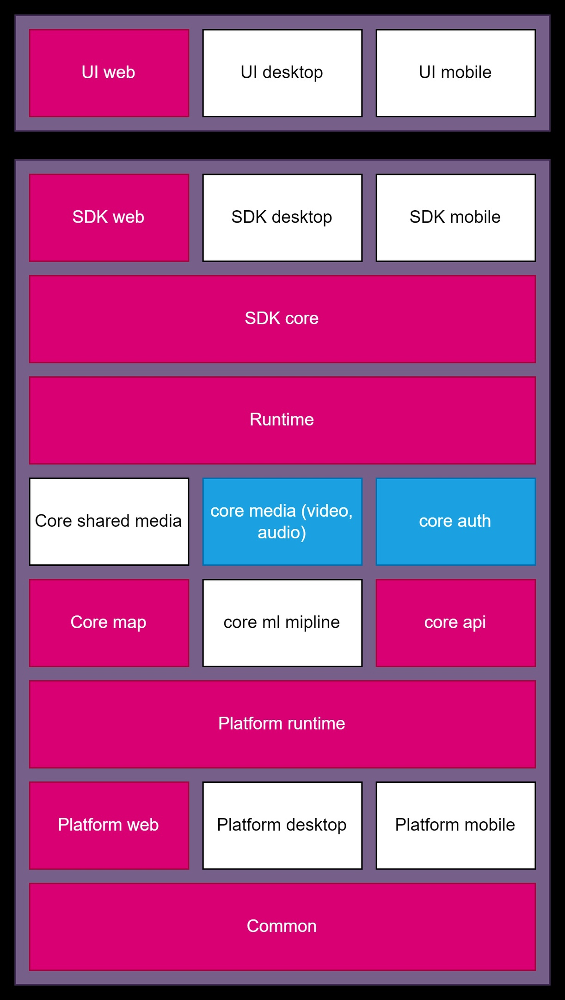

# Проект туристической карты

## Архитектура

Система представляет из себя адаптивное веб приложение, а также мобильное приложение (в разработке)
Причем у каждой веерсиим продукта свой кникальный интерфейс, однако внутренняя часть приложения
достаточно обширна, из-за чего было принято несколько важных решений:

### 1) используется монорепа.

Это нужно для того, чтоб не дублировать ядро приложения, которое будет активно расширяться.

### 2) Приложение разбита на 2 уровня.

Есть уровень пакетов и уровень приложений. На уровне пакетов реализуется вся основная бизнес логика,
причем реализация является платформо независимой.Если есть логика, которая зависит от плфтформы
(использование хранлимищь, API работы с камерой и тд), то для таких пакетов пишутся доп пакеты
для реализации этого функционала под каждую платформу.

Все эти пакеты потом объединяются в SDK, которое можно встроить в любую плаформу.

Вторым уровнем является уровень приложения, которое импортирует в себя SDK и является просто визуализирующей частью

Архитектукра пакетов показана ниже:

Каждый пакет представляет из себя отдельный `workspace` и может иметь уникальные зависиомости и их версии.

## Запуск проекта и его настройка

для каждой платформы и типа проекта существует свои `.env` файлы, которые используются для конфигурации приложения. Также с их помощью будет реализовываться испольхование `feature flags`.

Для возможности гибкого запуска приложения, а также применения исключительно нужных .env файлов для конкретной плфтормы был написан свой скрип (см папку `scripts`), которыей выполняет настройку среды, а после запускает основной скрипт

## Используемый стек

Для структурирования кода используется не честное MVC

Для удобного доступа к модулям и контроллерам используется `DI Container`. Изначально планировалась своя разработка (в репозитории есть пакет fismi), но не успел доделать, поэтому взял готовый `ditox`

Для работы с данными взят `rxjs` и `rx-effects`,  для создания rx потоков данных, однако логика по работе с данными на UI построена по принципу: вытащили начальное состояние из rx потока, а дальше обновляем актуальное состояние благодаря торчащим наружу публичным событиям (используется паттер `eventBus`)

Основная часть кода написана на `TypeScript`

### Web приложение

В качетсве сбощика используется `Vite`. Он работает намного быстрее, чем `webpack` и имеет куда меньше зависимостей из-за того, что написал на Go (под капотом использует `esbuild`). Интерфейс написан на `React18`

### Mobile

В качетсве мобильного решения планировалось использовать `ReactNative`, орднако возникли проблемы с настройкой монорепозитория под работу с `expo`
